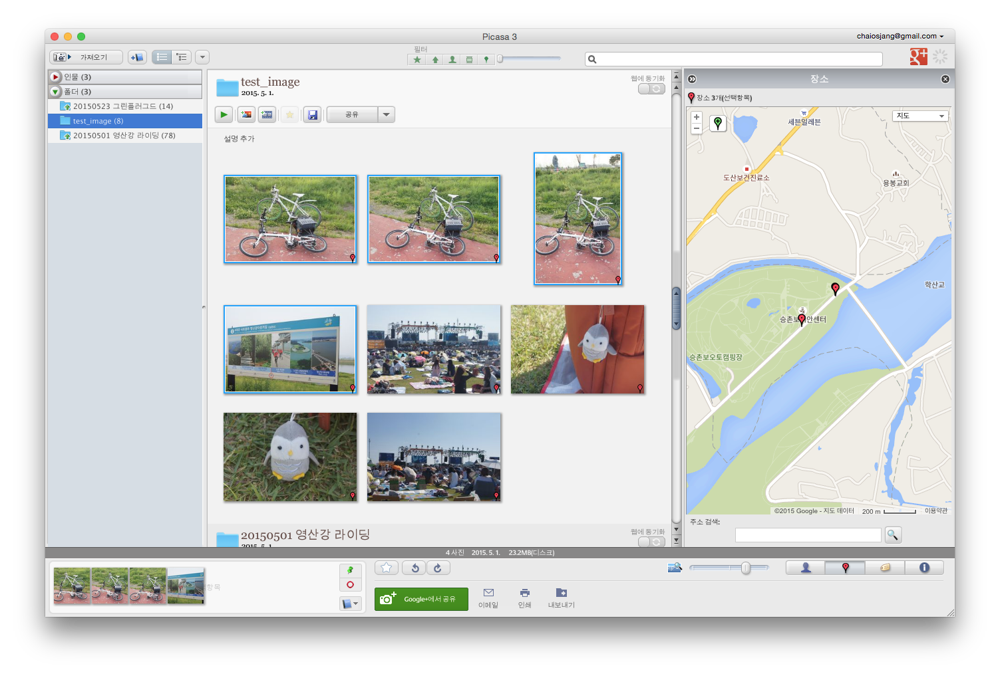
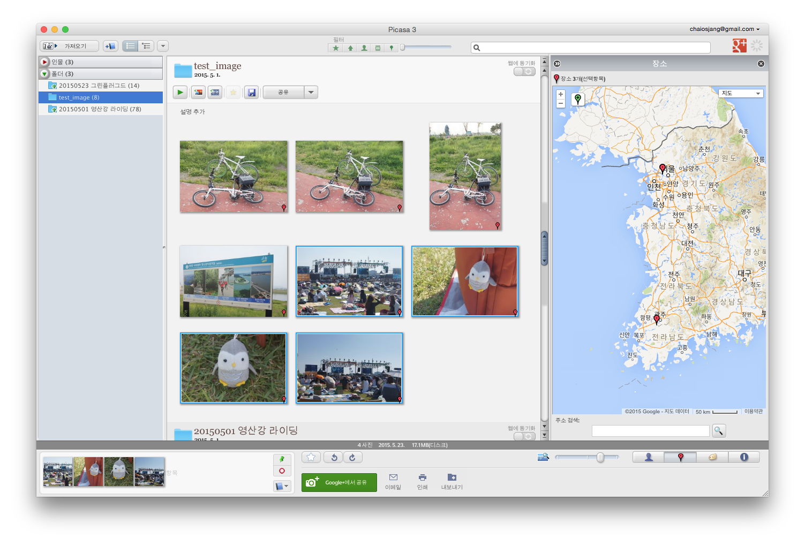

# GPS-CORRECT

## 문제점

GPS를 내장한 [Sony A55](http://ko.wikipedia.org/wiki/소니_DSLT-A55)DSLT 카메라로 촬영한 사진들의 GPS가 어긋나는 문제가 있다.

A55는 카메라를 켜고 GPS신호를 수신하기까지 시간이 오래 걸린다. GPS신호를 수신하지 못한 상태에서 사진을 촬영하면, 카메라가 기억하고 있는 가장 마지막 GPS좌표를 활용한다.

때문에 아래와 같은 문제가 발생한다.


'영산강 자전거 종주'사진이다. 전라남도 나주에서 촬영했다. 이 사진들은 GPS좌표가 잘 저장되었다.


'그린플러그드 음악축제'사진이다. 서울 난지도에서 촬영했다. 하지만 초기 몇장의 사진들의 위치는 나주를 가리키고 있다.

이러한 연유로, 해외여행 사진에서 국내 GPS좌표를 박힌 경우를 심심치 않게 볼 수 있다. 관광명소에서 찍은 사진에 호텔 GPS좌표가 찍혀 있어 아쉬운 경우도 있었다.

때문에 여행 이후에 사진을 하나하나 보아가며 수동으로 GPS좌표를 수정하곤 한다. 너무 불편해서 자동화 하고 싶다.

## 해결의 방향

아래와 같이 8장의 사진이 있다고 하자.
```
[ P1 P2 P3 P4 P5 P6 P7 P8 ]
```

1) 시간대가 비슷하게 찍힌 사진들을 모은다.
```
Cluster01 = [ P1 P2 P3 P4 ]
Cluster02 = [ P5 P6 P7 P8 ]
```

2) 각 Cluster에서 GPS좌표가 잘못 기록된, '오기록 후보군'을 추출한다.
```
Cluster01.Err = [ P1 P2 ]
Cluster02.Err = [ P5 P6 ]
```

3) 후보군으로 선정되지 않은 가장 빠른 번호의 GPS좌표를 후보군의 GPS좌표로 한다.
```
Cluster01.Err.setGps(P3.gps)
Cluster02.Err.setGps(P7.gps)
```
